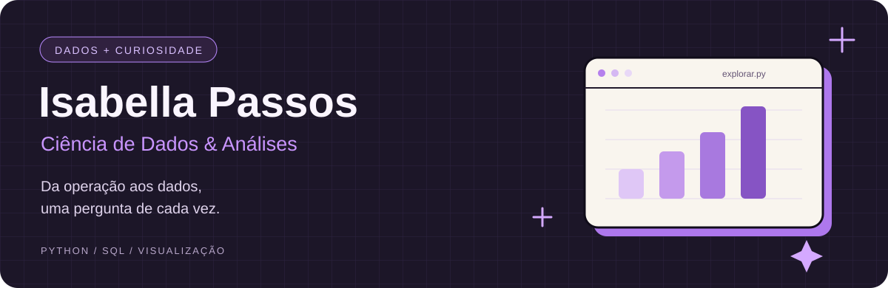

  

  <a href="https://www.linkedin.com/in/isabellabmpassos/" target="_blank" rel="noopener noreferrer">LinkedIn</a> ·
  <a href="https://isamedeirospassos.github.io/Portfolio/index.html#inicio" target="_blank" rel="noopener noreferrer">Meus projetos</a>

### ✦ Oi, eu sou a Isa!

Trabalho com operações e estudo Ciência de Dados. Gosto de entender o que está por trás dos números e transformar perguntas do dia a dia em análises que ajudem a tomar decisões.

Sou formada em **Análise e Desenvolvimento de Sistemas**, curso **Ciência de Dados na FMU** e o **bootcamp da TripleTen**. Por aqui, compartilho meus projetos, descobertas e o que venho aprendendo.

Também gosto de criar interfaces e explorar o lado visual da tecnologia com HTML e CSS. 💜

### ✦ Minha caixa de ferramentas

| Área | Ferramentas e estudos |
| :--- | :--- |
| Análise de dados | Python · Pandas · SQL · Jupyter Notebook |
| Visualização | Power BI · Tableau · Looker Studio · Excel |
| Desenvolvimento e colaboração | HTML · CSS · Git · GitHub |
| Aprofundando os estudos | Fundamentos de Machine Learning |

### ✦ Projetos para conhecer

**[Análise de COVID-19](https://github.com/isamedeirospassos/analise_covid)**  
Explorando a evolução dos casos, da vacinação e dos óbitos com visualização de dados.

**[Dashboard de finanças pessoais](https://github.com/isamedeirospassos/Dashboard-de-Finan-as-Pessoais)**  
Um projeto de dashboard voltado a finanças pessoais.

**[Portfólio](https://github.com/isamedeirospassos/Portfolio)**  
Meu espaço para reunir projetos e explorar criatividade, design e tecnologia.

### ✦ O que me move

Conectar minha experiência em operações com análise de dados, entender problemas reais e aprender construindo.

---

Entre uma pergunta, um gráfico e uma nova descoberta. ✦

